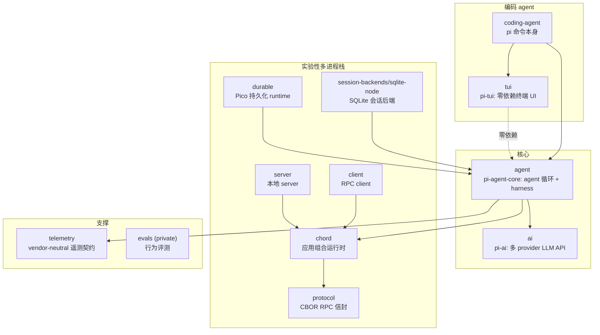
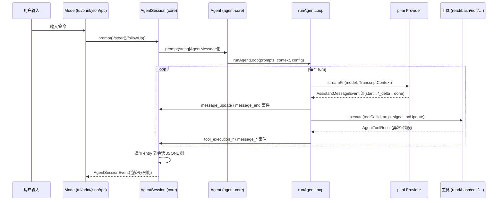

# 00 — pi 总览与设计哲学

> **一句话**:pi 自我定位是 "Pi Agent Harness" —— 一个**自扩展(self-extensible)的编码 agent**:极简的持久化 agent 运行时 + 极薄的模式无关业务核 + 进程内扩展系统;不设权限沙箱,直接继承启动者权限。

## 1. 定位

- README 标题即 "Pi Agent Harness"。权威的架构自述是 `packages/coding-agent/docs/how-pi-works.md`(49 行,建议作为重写时的第一对照物):会话是树,每条树路径是一个分支,活动分支供给下一次模型请求,扩展以 TypeScript 模块形态加载进 pi 进程内。
- 三个核心包被显式标出:
  - `@earendil-works/pi-coding-agent`(CLI,`pi` 命令)
  - `@earendil-works/pi-agent-core`(通用 agent 运行时)
  - `@earendil-works/pi-ai`(统一多 provider LLM API)

## 2. 核心设计原则(重写时需要继承或显式决策的)

1. **transcript 是唯一真值**:系统提示词、工具集声明都以"转录中的 system 消息"形态存在,而不是请求参数。回放转录 = 重建完整请求状态(`packages/ai/src/types.ts:505-531` 的 `SystemMessage` 注释把这一设计写得非常清楚)。
2. **无内置权限系统**:pi 刻意不做文件/进程/网络权限沙箱,直接继承启动 pi 的用户权限;需要隔离时用容器化解决(`packages/coding-agent/docs/containerization.md` 给出 Gondolin micro-VM / Docker / OpenShell 三种模式)。信任决策只在"是否加载项目级设置与扩展"这一层(`packages/coding-agent/src/core/project-trust.ts:96`)。
3. **扩展即进程内代码**:扩展是 TS 模块,通过工厂函数拿到 `ExtensionAPI`,与宿主共享类型与事件;四种运行模式为同一个 `ExtensionContext` 提供各自的 UI 实现(print/json 下是 no-op)。
4. **mode 与业务分离**:`main → cli → core → modes`,`core/` 是所有模式共享的唯一业务层(`packages/coding-agent/src/core/index.ts` 注释 "Core modules shared between all run modes"),modes 只做 I/O。
5. **流式失败不抛异常**:StreamFn 契约 —— 请求/模型/运行时失败必须编码进事件流,以 `stopReason: "error"|"aborted"` 的终态 AssistantMessage 收尾(`packages/agent/src/types.ts:26-37`)。
6. **会话 append-only**:JSONL 文件只追加;分支、压缩、上下文修改都是追加新 entry,从不改写历史(`how-pi-works.md` §Sessions)。
7. **工程方针**(AGENTS.md,125 行):
   - 只用 **erasable TypeScript**(Node strip-only 模式):禁 enum/namespace/`import =`/构造函数参数属性,源码以 `.ts` 后缀直接 import —— dist 与源码行为一致;
   - 只允许顶层静态 import,禁止 `await import()`;
   - 除非绝对必要不用 `any`;单调用点的辅助函数内联;
   - **无向后兼容包袱**:"Do not preserve backward compatibility unless the user asks";
   - **供应链安全是核心方针**:外部依赖钉死精确版本,lockfile 是唯一真值;CLI 发布带从根 lockfile 生成的 `npm-shrinkwrap.json`;依赖生命周期脚本有显式 allowlist;`min-release-age=2` 拒绝当日发布的包;
   - coding-agent 内的资产路径必须经 `src/config.ts` 的 helper(兼容源码 checkout / npm 安装 / 独立二进制三种形态);
   - 每次改动跑 `npm run check`(biome + 多项自检 + tsgo 全仓类型检查)。

## 3. monorepo 包结构(12 包)

| 包 | npm 名 | 一句话职责 |
|---|---|---|
| `packages/agent` | `@earendil-works/pi-agent-core` | 通用 agent 运行时:无状态循环 `runAgentLoop` + 有状态 `Agent` 类;`src/harness/` 是实验性持久化运行时(coding-agent 尚未使用) |
| `packages/ai` | `@earendil-works/pi-ai` | 多 provider 抽象:10 种 API 协议适配器、~40 provider、模型目录、流式事件协议、重试 |
| `packages/coding-agent` | `@earendil-works/pi-coding-agent` | 编码 agent CLI:业务核(core)、四种模式、扩展、内置工具 |
| `packages/tui` | `@earendil-works/pi-tui` | 零依赖终端 UI 库:差分渲染、同步输出、组件库;不知道 agent 的存在 |
| `packages/chord` | `@earendil-works/chord` | 应用组合运行时(facets/plugins/services/复制状态 Delta),protocol 的 payload 语义归它所有 |
| `packages/protocol` | `@earendil-works/pi-protocol` | 4 字节长度前缀 + CBOR 的 RPC 信封(protocol version 8) |
| `packages/server` | `@earendil-works/pi-server` | 实验性本地 server:透明路由与 attachment 生命周期,Unix socket 传输 |
| `packages/client` | `@earendil-works/pi-client` | RPC client:request/subscribe 原语,不自动重连 |
| `packages/durable` | `@earendil-works/pi-durable` | Pico runtime:持久化记录契约 + memory/JSONL/SQLite 存储 |
| `packages/session-backends/sqlite-node` | `@earendil-works/pi-session-backend-sqlite-node` | 给 agent 包的 Session 提供 node:sqlite 后端 |
| `packages/telemetry` | `@earendil-works/pi-telemetry` | 显式回调式遥测契约,无 exporter、无全局状态 |
| `packages/evals` | (private) | 基于 vitest-evals 的行为评测 |

## 4. 构建体系

- **npm workspaces**(根 `package.json` L5-13):`packages/*`、`packages/session-backends/*` 及 4 个示例扩展目录。
- **编译器 = tsgo**(`@typescript/native-preview`):每包 `tsgo -p tsconfig.build.json` 出 `dist/`。
- **构建顺序固定串联**(根 build 脚本):chord → tui → telemetry → ai(含模型目录生成)→ durable → agent → session-backends/sqlite-node → protocol → client → server → coding-agent。
- **coding-agent 特殊**:tsgo 出 unbundled dist 后,用 **esbuild**(`scripts/build-coding-agent-bundle.mjs`)打 `dist/bundle/cli.js`(bin: `pi`)与 `dist/bundle/rpc-entry.js`;独立单文件二进制用 **Bun compile**(`bun build --compile ./src/bun/cli.ts`)。
- **质量门**:biome、`check:pinned-deps`(依赖精确版本)、`check:shrinkwrap`、`check:ts-imports`、`check:entry-graphs`、`tsgo --noEmit`;测试 vitest(tui 例外用 `node --test`)。
- **发布**:所有包同版本,`scripts/sync-versions.js` 同步,`scripts/publish.mjs` 发布。

## 5. 数据流总图

## 6. 源码文件索引(全仓包级)

| 路径 | 规模 | 职责 | 关键符号 | 优先级 |
|---|---|---|---|---|
| `packages/agent/src/` | 核心 ~2.6k 行 + harness ~25k 行 | agent 循环与运行时 | 见 03 文档索引 | P0 |
| `packages/ai/src/` | 核心 ~7k 行 + api 适配器 ~10k 行 | provider 抽象 | 见 02 文档索引 | P0 |
| `packages/coding-agent/src/` | ~75k 行(含 modes/experimental) | 业务核与模式 | 见 04-08 文档索引 | P0(core) |
| `packages/coding-agent/docs/how-pi-works.md` | 49 行 | 权威架构自述 | — | P0 |
| `AGENTS.md`(仓库根) | 125 行 | 工程方针 | — | P1 |
| `README.md`(仓库根) | 116 行 | 定位与设计哲学 | — | P1 |
| `packages/coding-agent/docs/containerization.md` | 183 行 | 无权限系统的容器化补偿方案 | — | P2 |
| `packages/tui/src/` | ~22.7k 行 | 终端 UI 库 | 见 08 文档索引 | P1 |
| `packages/protocol/src/` | 743 行 | CBOR RPC 信封 | `protocol.ts`(110 行), `framing.ts`(151), `codec.ts`(141) | P2 |
| `packages/server/src/` | ~1.9k 行 | 本地 server | `server.ts`(576), `session-router.ts`(312) | P2 |
| `packages/client/src/` | ~1.1k 行 | RPC client | `client.ts`(479) | P2 |
| `packages/chord/src/` | — | 组合运行时 | `context/`, `delta/`, `facets/`, `services/` | P2 |
| `packages/durable/src/` | — | Pico 持久化契约 | `types.ts`, `storage/` | P2 |
| `packages/telemetry/src/` | 3 文件 | 遥测契约 | `noop.ts`, `memory.ts` | P2 |
