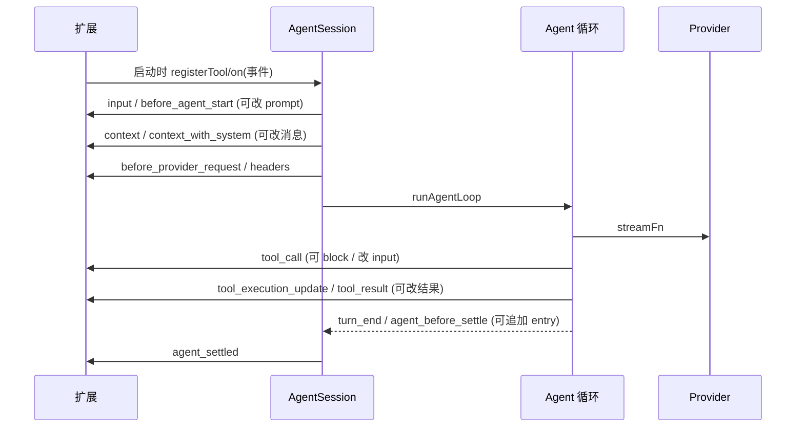

# 07 — 扩展系统

> **一句话**:扩展 = 进程内加载的 TypeScript 工厂模块,拿到一个 `ExtensionAPI`(约 40 种强类型事件订阅 + 工具/命令/快捷键/flag/渲染器/provider 注册面);所有干预能力都走事件管道(block 工具、改参、换 payload、追加 entry),UI 需求经 `ExtensionContext.ui` 抽象,四种 mode 各自实现(print/json 下为 no-op)。

## 1. 发现与加载(`src/core/extensions/loader.ts`,799 行)

发现顺序(`discoverAndLoadExtensions` @ loader.ts:751):

1. 项目 `.pi/extensions/` 目录;
2. 全局 `~/.pi/agent/extensions/`;
3. settings 显式路径;
4. `package.json` 的 `"pi.extensions"` 字段(entry 解析 `resolveExtensionEntries` @672:认 `package.json` 声明或 `index.ts/js`)。

TS 源码用 **jiti** 加载(`jiti-loader.ts`,3 行薄壳;复用宿主模块与 tsconfig paths)。扩展导出工厂:

```ts
type ExtensionFactory = (pi: ExtensionAPI) => void | Promise<void>;   // @ types.ts:1762
```

## 2. `ExtensionAPI`(`extensions/types.ts`,1972 行)

`interface ExtensionAPI` @1365。注册面:

| 方法 | 行号 | 说明 |
|---|---|---|
| `on(event, handler)` | @1370-1436(重载) | 约 40 种事件的强类型订阅,返回退订函数 |
| `registerTool(def)` | @1443 | 注册 ToolDefinition(五合一,见 04 文档) |
| `registerCommand(name, options)` | @1452 | slash 命令 |
| `registerShortcut` / `registerFlag` / `getFlag` | — | 键位 / CLI flag |
| `registerMessageRenderer` / `registerEntryRenderer` / `registerMarkdownTransformer` | — | 渲染 |
| `sendMessage` / `sendUserMessage` / `appendEntry` | — | 注入消息 / 追加 entry |
| `setSessionName` / `setLabel` / `exec` / `setModel` / `setThinkingLevel` | — | 会话操作 |
| `getActiveTools` / `setActiveTools` / `getAllTools` / `getCommands` | — | 工具与命令查询 |
| `registerProvider(provider)` / `registerProvider(name, config)` | @1621-1622 | 自定义 provider:含 `oauth` 登录流与 `streamSimple` 完全自定义 API 实现(`ProviderConfig` @1647);`unregisterProvider` @1637 |
| 共享 `events: EventBus` | — | 扩展间通信 |

## 3. 事件全集(`ExtensionEvent` @1185-1216,按管线分组)

**生命周期**:`project_trust`、`resources_discover`、`session_start/before_switch/before_fork/before_compact/compact/compact_failed/shutdown/before_tree/tree`。

**LLM 请求管线**(干预上下文与请求):

| 事件 | 能力 |
|---|---|
| `context` | 改 messages(不含系统消息,prompt 由 pi 恢复) |
| `context_with_system` | 完整 transcript,**handler 拥有 prompt 和工具声明** |
| `cache_warming_decision` | 决定是否保温 |
| `before_provider_request` | 可替换整个请求 payload |
| `before_provider_headers` | 原地改 header(null 删 header) |
| `after_provider_response` | 观察响应 |
| `provider_stream_event` | 原始 provider 流事件 |

**agent**:`before_agent_start`(可替换 systemPrompt/注入消息)、`agent_start/end`、`agent_before_settle`(可追加 `SessionBoundaryDraft`:custom/custom_message/context_edit/compaction entry)、`agent_settled`、`turn_start/end`、`message_start/update/end`(message_end 可替换消息)、`model_select`、`thinking_level_select`。

**工具**:`tool_call`(**可 block** + 原地改 `event.input`;结果类型 `ToolCallEventResult{block, reason, terminate}` @1233)、`tool_result`(可改 content/details/isError/usage)、`tool_execution_start/update/end`;类型守卫 `isToolCallEventType`(@1168)。

**输入**:`input`(可 transform/handled)、`user_bash`(`!`/`!!` 前缀命令,可换执行后端或返回自定义结果)、`ui_prompt_start/end`。



## 4. `ExtensionContext`(事件处理器收到的 ctx,@319)

- `ui: ExtensionUIContext`(@143):`select/confirm/input/notify/setStatus/setWidget/setFooter/setHeader/custom overlay/setEditorComponent`、主题等 —— **每个 mode 提供各自实现**;print/json 是 no-op;
- `mode: "tui" | "rpc" | "json" | "print"`、`hasUI`;
- `sessionManager`(只读视图)、`modelRegistry`、`abort()`、`isIdle()`、`getContextUsage()`、`compact()`、`getSystemPrompt()`、`cwd`、`model`、`thinkingLevel`;
- 命令场景的 `ExtensionCommandContext`(@365)额外有 `newSession/fork/navigateTree/switchSession/reload`。

## 5. 运行时装配(`extensions/types.ts` 尾部 + `runner.ts`)

- `ExtensionRuntimeState`(@1843:flag 值 + 排队的 provider 注册)+ `ExtensionActions`(@1870,由 AgentSession 实现的动作表)+ `ExtensionContextActions`(@1891)合成 `ExtensionRuntime`;loader 先用 throwing stub 创建,`runner.initialize()` 补齐;
- `Extension`(@1939)= `{path, handlers: Map<string, HandlerFn[]>, tools, messageRenderers, commands, flags, shortcuts, ...}`;
- `runner.ts`(1452 行):按**注册顺序**执行 handlers、管理错误收集(`ExtensionError`)与失效(stale)标记;单个 handler 抛错不击穿宿主(收集为诊断);
- 装载入口:`extensions/index.ts`(212 行)、`wrapper.ts`(27)、`virtual-modules.ts`(38,jiti 虚拟模块)。

## 6. 用户参考案例

本机 `~/.pi/agent/settings.json` 启用了两个用户自研扩展(仓库 `/Users/kin/Documents/10source/pi-agent-extensions`):`subagent-lite/` 与 `plan-mode-lite/` —— 都是标准工厂形态,重写扩展兼容层时可作行为对照。

## 7. 源码文件索引

| 文件 | 行数 | 职责 | 关键符号 | 优先级 |
|---|---|---|---|---|
| `packages/coding-agent/src/core/extensions/types.ts` | 1972 | **API 面全部类型** | `ExtensionUIContext`:143, `ExtensionContext`:319, `ExtensionCommandContext`:365, `ToolDefinition`:461, `isToolCallEventType`:1168, `ExtensionEvent`:1185, `ToolCallEventResult`:1233, `ExtensionAPI`:1365, `registerCommand`:1452, `registerProvider`:1621, `ProviderConfig`:1647, `ExtensionFactory`:1762, `ExtensionRuntimeState`:1843, `ExtensionActions`:1870, `ExtensionContextActions`:1891, `Extension`:1939 | P0 |
| `packages/coding-agent/src/core/extensions/runner.ts` | 1452 | 事件分发与错误收集 | 按序执行 / stale 处理 | P0 |
| `packages/coding-agent/src/core/extensions/loader.ts` | 799 | 发现与装载 | entry 探测:667, `discoverAndLoadExtensions`:751 | P0 |
| `packages/coding-agent/src/core/extensions/index.ts` | 212 | 装配入口 | — | P1 |
| `packages/coding-agent/src/core/extensions/virtual-modules.ts` | 38 | jiti 虚拟模块 | — | P2 |
| `packages/coding-agent/src/core/extensions/wrapper.ts` | 27 | 包装 | — | P2 |
| `packages/coding-agent/src/core/extensions/jiti-loader.ts` | 3 | jiti 壳 | — | P2 |
| `packages/coding-agent/src/core/tools/tool-definition-wrapper.ts` | 47 | ToolDefinition → AgentTool | `wrapToolDefinition` | P0 |
| `packages/coding-agent/src/core/bash-executor.ts` | 156 | `!` 裸 shell(user_bash 事件来源) | — | P2 |

阅读顺序:`types.ts`(§ExtensionEvent → ExtensionAPI → ExtensionContext)→ `loader.ts`(发现顺序)→ `runner.ts`(分发与错误语义)。

---

## 8. rpi 落地设计:B 方案 —— 进程外扩展,通讯 = MCP(决策记录 2026-09-26)

> **一句话**:rpi 的动态扩展定为**独立进程**形态,通讯复用 **MCP**(官方 Rust SDK `rmcp`);埋点面 = rpi 已有的两条接缝(`Subscriber` 事件汇 + `LoopHooks` 决策点),由一个公共分发函数 `ExtensionEventBus` 统一推上 MCP 线缆;宿主与扩展的错误语义是"跳过 + 收集诊断,绝不击穿宿主"。本节是 rpi 侧设计,与上文 pi 分析(§1-7)互为对照。

### 8.1 路线对比与选型理由(讨论结论)

三条候选路线的关键数据(release 二进制增量 / 单事件开销 / 实现规模):

| | A 脚本引擎(进程内) | B 进程外(本决策) | C WASM |
|---|---|---|---|
| 体积 | deno_core +30–60MB;rquickjs +1–3MB | ≈0 | wasmtime +10–40MB |
| 单事件往返 | 进程内调用,µs 级 | pipe RTT + JSON 编解码,约 0.1–1ms | 边界值转换,接近 B |
| 报错隔离 | 引擎边界捕获(好) | 进程边界(最好) | 内存级 + fuel(最好) |
| 挂起防护 | interrupt handler | watchdog kill | fuel/epoch 计量 |
| 异步/反向调用 | deno_core 原生;rquickjs 需自研桥 | 协议多路复用 | WIT 重入,风险最高 |
| 实现 | 1.5–3.5k 行 | 1.5–2.5k 行(自研协议部分现被 MCP 吸收) | 2k 行 + 作者工具链 |

关键结论(选 B 的理由,按讨论顺序):

1. **pi 的进程内 TS 模式依托"宿主本身是 Node 运行时"的零边际成本福利**(扩展只是往现成 V8 里注册模块);Rust 宿主没有这个福利,复制它的唯一途径是嵌入引擎,代价如上表;
2. **B 的真实成本是内存边际成本,不是 CPU**:空闲 MCP server 阻塞在 `read()` 上,零 CPU;每扩展一份运行时内存(Node 系约 50–80MB RSS)。扩展数量多且为脚本语言实现时账单可观——用 Go/Rust 写 server 或懒加载可压;
3. **B 的表达力上限是值语义**(拷贝、无闭包、无活引用),UI 深度封顶(做不了活 TUI 组件)、高频流事件只能降级为批量。可接受的依据:实测 pi 真实扩展(plan-mode-lite / subagent-lite)的全部 UI 用量只有 `notify/setStatus/select/input`,落在封闭交互原语内;
4. **自研协议的价值大部分被 MCP 吸收**:工具注册/执行/进度/取消、UI 反向调用(elicitation)、握手能力声明都是 MCP 标准方法,自研部分只剩事件埋点通道(`rpi/event`);
5. WASM 的独特价值(fuel 计量、分发不可信扩展)当前无需求,仍列远期(10 §6)。

### 8.2 能力边界:rpi 两条接缝能实现什么

rpi 已有的两条接缝恰好构成"宿主 → 扩展"的全部通道;pi 的 40 种事件按其覆盖情况分五类:

| pi 事件组 | rpi 覆盖 | 说明 |
|---|---|---|
| agent 循环(agent_start/end、turn、message_*、agent_settled) | ✅ `Subscriber`(接缝 #6) | 观察类,单向广播无返回值:渲染/持久化/审计/统计/外部联动 |
| 工具(tool_call、tool_result、tool_execution_*) | ✅ 两条缝组合 | `before_tool_call` 可 block/terminate/**改参(需 ToolBlock.args,见 8.6)**;`after_tool_call` 逐字段 Patch;execution 三事件走 Subscriber |
| LLM 请求管线深层(换整个 payload、headers、原始流事件) | ❌ | rpi 只有 `prepare_request` 的 model/thinkingLevel 子集;provider 调试类扩展暂不支持 |
| 会话生命周期(session_start/switch/fork/compact/tree) | ❌ | rpi-session 尚无事件面,SessionSink 只有 append;属 session 侧增量,与扩展机制解耦 |
| 扩展主动动作(sendMessage、appendEntry、compact、exec) | ❌ | 这是"扩展 → 宿主"的第三条通道(接缝 #4 `ExtensionActions`,现仅 `ui()/notify()`);MCP 下对应 server→client 请求,elicitation 是其第一个用户,sendMessage 等列二期 |

真实扩展用量(实测两个 pi 扩展)100% 落在已覆盖面内:事件仅 `tool_call/session_start/session_shutdown/before_agent_start`,API 约 10 个方法,UI 仅 `notify/setStatus/select/input`。

### 8.3 埋点全集与公共分发函数

**设计原则:循环零改动。**埋点面就是两条接缝的现有点位,不在 run_agent_loop 里新开洞:

- **观察类**(通知,不需回应)→ 接缝 #6:`AgentStart/TurnStart/TurnEnd/MessageStart/MessageDelta/MessageUpdate/MessageEnd/ToolExecutionStart/Update/End/AgentEnd`(rpi-agent `event.rs`)+ session 级 `AgentSettled/QueueUpdate/AutoRetryStart/AutoRetryEnd`(rpi-core `session.rs`)。高频流事件(MessageDelta/MessageUpdate)**默认不上线缆**,扩展注册时显式声明才推送;
- **决策类**(同步请求-回应)→ 接缝 #2(`hooks.rs`):`before_tool_call`→tool_call、`after_tool_call`→tool_result、`transform_context`→context、`prepare_request`→before_request、`prepare_next_turn`/`finish_turn`→turn 边界。

**公共分发函数**(核心交付,一条路径覆盖全部埋点):

```rust
// rpi-core::extensions::ExtensionEventBus
async fn dispatch(&self, ev: ExtensionEvent, payload: Value) -> EventOutcome
```

职责四条:

1. **订阅过滤**:只发给注册时声明订阅该事件的扩展(能力声明经 `rpi/register` 提交:事件表 + 每事件超时 + fail-open/closed 语义);
2. **观察类**:JSON-RPC notification 发出即走;**决策类**:request 按注册顺序串行 await,`block` 短路,改参链式传递(前一扩展输出 = 后一扩展输入),聚合为 `ToolBlock`/`ToolPatch`/上下文变换;
3. **错误隔离**:超时/断连/错误 → 记 `ExtensionDiagnostic`,不击穿宿主;fail-open/fail-closed 按该扩展注册时声明(安全类扩展应 fail-closed,普通扩展 fail-open);
4. **接入方式**:`impl Subscriber for ExtensionEventBus`(观察类)+ `ExtensionHooks` 包装内层 `LoopHooks` + bus(决策类先问扩展再透传)——装配期在 cli 组合,`Agent`/`AgentSession` 不感知 MCP。

### 8.4 MCP 协议面映射

通讯载体:rmcp(pin 版本;3.4.1 时点 client/server/elicitation 特性齐备,新 spec 支持 beta)。每个扩展 = 一个长驻 MCP stdio server,rpi 启动 spawn、退出回收。

| 能力 | MCP 方法 | 备注 |
|---|---|---|
| 能力注册 | 自定义 `rpi/register` | 订阅事件表、每事件超时、fail 语义 |
| 事件埋点 | 自定义 `rpi/event` | request/notification 同名两用(决策类/观察类) |
| 工具注册与执行 | `tools/list`、`tools/call` | 桥成 `Arc<dyn Tool>`(`McpTool`) |
| 工具进度 | `notifications/progress` | → `ToolUpdater` |
| 工具取消 | `notifications/cancelled` | ↔ `CancellationToken` |
| UI(select/input/confirm) | `elicitation/create` | → `ExtensionUi`(需加 select/input 默认 no-op 方法) |
| notify | `notifications/message`(logging) | |
| sendMessage/appendEntry | 二期:自定义 server→client 方法 | 见 8.2 第三条通道 |

进程生命周期:崩溃/挂起 → 连接断开 → 诊断 + 标记该扩展失效(可选自动重启重新握手);等待中的决策请求由宿主 pending 表作废。

### 8.5 错误语义(对齐 pi,已确认)

- **编译期扩展 `init` 失败 → 跳过 + 收集诊断**,session 照常创建(改判原 fail-fast;理由:与 pi loader 的 continue+warning 一致,未来多扩展时一个坏的拖不死整体,且编译期/MCP 两种加载语义一致)。实现时须**逐扩展独立工具缓冲**,init 失败不留已注册工具(对齐 pi"失败扩展整个丢弃");
- **运行期 handler 失败/超时/断连 → 诊断 + 跳过该次分发**,绝不击穿宿主(pi runner 的 try/catch-per-handler 语义);诊断经 `ExtensionDiagnostic { extension, message }` 面向 mode 可见;
- **"不许 panic"是约定不是隔离**:runner 分发层对 handler 调用加 `catch_unwind` 防御(panic 降级为诊断)。

### 8.6 接缝修改登记

- 接缝 #2 `LoopHooks::before_tool_call` 的返回类型 `ToolBlock` 增加 `args: Option<serde_json::Value>` 字段:使 tool_call 事件支持改参(对齐 pi 原地改 `event.input`;字段缺省 None = 不改)。登记于 10 §3,实现时更新全部构造点(默认实现不受影响);
- 接缝 #5 `ExtensionUi` 增加 `select`/`input` 方法(带默认 no-op 实现,print/json 零改动;interactive 真 UI 随 M5)。

### 8.7 实施步骤(未开始,实施时按序)

1. `ToolBlock.args` 接缝修改 + `ExtensionUi::select/input`;
2. `rpi-core::extensions` 升目录模块:`event_bus.rs`(ExtensionEvent 枚举 + ExtensionEventBus + ExtensionDiagnostic)、`mcp_host.rs`(连接管理/rpi/register/rpi/event)、`mcp_tool.rs`(McpTool 桥);`create_agent_session` 改逐扩展独立工具缓冲 + init 失败跳过诊断;
3. cli:settings(`mcpServers: [{command, args, env}]`)→ spawn 扩展 → 装配 `ExtensionHooks`;诊断打 stderr;
4. 测试(rmcp in-memory transport 起 mock server):观察事件按订阅转发/未订阅不转/高频默认不推;block 短路 + 多扩展顺序 + 改参链式;超时 fail-open/closed;断连诊断;McpTool 执行/进度/取消;elicitation no-op 与真实现两路;编译期扩展回归(init 跳过+诊断、部分注册隔离);
5. 端到端验收:`--mock` 链路上 mock MCP 扩展完成"注册工具 + 拦截危险 bash + elicitation 确认"。

风险与退路:rmcp 新 spec 支持为 beta → pin 精确版本 + in-memory 测试锁行为;若自定义方法 API 受阻,同一条 stdio 换 `jsonrpsee` 自管 JSON-RPC(协议不变,仅换 client 层);elicitation 若不完整,先以自定义 server→client 方法过渡。

### 8.8 wire 协议补充(2026-09-26 实现落地,§8.4 的细化)

- **响应信封**:扩展对 `rpi/register` / `rpi/event` 的响应必须是 `{"rpiResult": <事件特定载荷>}`。原因:rmcp 的 `ServerResult` 是 untagged union,裸载荷(如 `{"isError":true}`)会被贪婪解析成 `CallToolResult` 而丢失(见踩坑记录 1)。
- **注册响应 schema**:`ExtensionRegistration { events: { <事件 wire 名>: { timeoutMs?, failClosed? } }, highFrequency: [事件名] }`;事件 wire 名一律 **snake_case**(对齐 pi 命名)。高频事件(MessageDelta/MessageUpdate/ToolExecutionUpdate)需要 `events` 表与 `highFrequency` **双重声明**(events 表声明订阅,highFrequency 解除默认不上线缆)。
- **事件请求载荷**:`{"event": "<wire 名>", "payload": {...}}`;tool_call 的 payload 即 `ToolCallCtx` 的 serde camelCase 形态(`{toolCallId, name, args}`)。
- **工具名前缀**:MCP 工具桥接为 `{extension}__{tool}`(扩展名清洗为 `[a-zA-Z0-9_-]`,重名扩展装配期记诊断跳过);tool_call 事件里的 `name` 是**原始名**,与前缀无关。
- **fail-closed 语义细化**:仅 tool_call 有"拒绝动作"语义(含断连后:死掉的守卫扩展不静默放行);其余决策事件 fail-closed 退化为跳过 + 诊断。`prepare_request` 的 thinkingLevel 只能设值、不能显式关闭(Option<Option<T>> 经 JSON 不可区分 null 与缺省)。
- **decision 链式传递全事件覆盖**:tool_call.args、context.messages、before_request.model/thinkingLevel、prepare_next_turn.messages/model/thinkingLevel、finish_turn.decision 均回写 payload(前一扩展输出 = 后一扩展输入)。

## 踩坑记录

- **2026-09-26 rmcp untagged `ServerResult` 贪婪解析吞掉自定义响应**:现象:`rpi/event` 返回 `{"isError":true,"output":...}` 时 client 侧匹配到 `ServerResult::CallToolResult` 而非 `CustomResult`,分发层误报 "unexpected response"。→ 原因:`CallToolResult` 的已知字段(isError 等)与自定义响应载荷撞车,untagged 序列先命中前者。→ 解法:协议加 `{"rpiResult": ...}` 信封(§8.8),`unwrap_rpi_result` 统一解包。(关联文件:`crates/rpi-core/src/extensions/mcp_host.rs`)
- **2026-09-26 `serve_server(...).await` 在 initialize 前阻塞导致测试死锁**:现象:in-memory duplex 测试先 `serve_server().await` 再连 client,永远挂起。→ 原因:rmcp server 侧 serve 会阻塞到收到 `initialize` 请求。→ 解法:server 侧必须 `tokio::spawn` 与 client 并发;stdio 形态(stdin/stdout)无此问题。(关联文件:`crates/rpi-core/tests/extensions_mcp.rs`)
- **2026-09-26 观察类通知发送可被挂起的扩展无限阻塞**:现象:`Peer::send_notification` 会 await transport 写完成,扩展进程 SIGSTOP 后管道写满 → agent 循环的 Subscriber 串行链卡死(违背"绝不击穿宿主")。→ 解法:通知发送包 5s 超时,超时 mark_stale + 诊断;tools/call 的**入队阶段**同理(select 覆盖发送与等待全程)。(关联文件:`crates/rpi-core/src/extensions/event_bus.rs`、`mcp_tool.rs`)
- **2026-09-26 elicitation schema 是强类型 `ElicitationSchema` 而非裸 JSON Schema**:现象:按 pi 习惯直接读 `requested_schema.get("properties")` 编译失败。→ 原因:rmcp 3.4.1 把 elicitation 收敛为 `PrimitiveSchemaDefinition`(Enum/String/Number/Integer/Boolean)强类型 enum,单选枚举经 `EnumSchema::builder(values).build()`。→ 解法:桥按变体匹配(boolean→confirm、enum→select、string→input),且属性名必须恰好是 `value` 才映射到 `ExtensionUi`。(关联文件:`crates/rpi-core/src/extensions/mcp_host.rs` `bridge_elicitation`)
- **2026-09-26 `ToolCallCtx` 的 wire 字段是 `name` 不是 `toolName`**:现象:mock 扩展按 `toolName` 取工具名全部落空,rpi/event 恒回 `{}`。→ 原因:`ToolCallCtx` derive `rename_all = "camelCase"`,字段 `name` 序列化为 `name`。→ 解法:埋点载荷以 Rust 类型的 serde 形态为权威,mock/文档对齐(§8.8)。(关联文件:`crates/rpi-core/src/extensions/event_bus.rs`)
