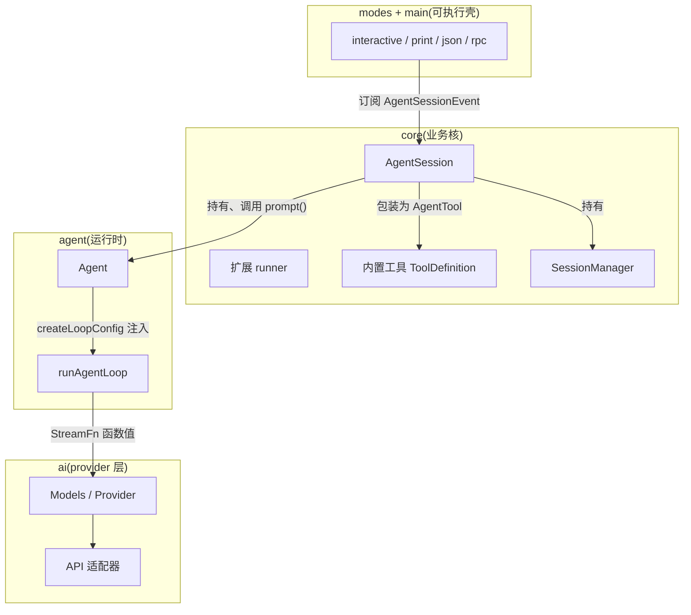

# 09 — 模块协调机制与 Rust 实现映射

> **一句话**:pi 的模块协调只靠三条单向通道 —— **类型向下依赖、回调向上注入、事件单向广播**;没有任何模块向上 import。这恰好是 Rust 友好的结构:回调 → trait,事件 → enum + 有序订阅者,函数注入 → trait object,声明合并扩展 → 封闭 enum + Custom 逃生口(或 WASM)。

---

## Part A — pi 里各模块如何相互引用

### A1. 依赖方向:严格的单向四层



关键事实:**`packages/agent` 不 import 任何 provider 代码**;`packages/tui` 不 import agent;`SessionManager` 不知道 `Agent` 的存在。类型(`AgentMessage`/`Model`/`Tool`)从下往上被引用,行为从上往下被注入。

### A2. 六个关键接缝(依赖倒置点)

| # | 接缝 | 代码位置 | 机制 |
|---|---|---|---|
| 1 | **循环 ↔ provider** | `stream-fn.ts:11-20` + `agent-loop.ts:402` | 循环只认 `StreamFn` 函数类型;宿主启动时 `setDefaultStreamFn()` 安装实现(最终是 `Models.streamSimple`)。循环对"哪家 provider"零知识 |
| 2 | **Agent ↔ 循环** | `agent.ts:467-505` `createLoopConfig()` | Agent 把**自己的队列 drain** 绑定成循环的 `getSteeringMessages`/`getFollowUpMessages`;把状态快照 `createContextSnapshot()`(:460-465,`messages.slice()`)喂给循环;把自己的 `processEvents` 绑定为事件 sink(:441) |
| 3 | **循环 ↔ 工具** | `agent-loop.ts:710` | `context.tools` 按名查找,只认 `AgentTool` 接口;工具对象由上层构造(`tool-definition-wrapper.ts` 把带 UI 的 ToolDefinition 剥成纯执行体) |
| 4 | **core ↔ agent** | `agent-session.ts:529/608/675` 三个 installer | AgentSession 持有 `Agent` 实例,把 agent 的 `beforeToolCall/afterToolCall/turn_end` 等钩子**翻译成扩展事件**;Agent 不知道扩展存在 |
| 5 | **core ↔ 扩展** | `extensions/types.ts:1870` `ExtensionActions` | 扩展 runner 只依赖 `ExtensionActions` **接口**,实际由 AgentSession 实现 —— runner 不 import agent-session.ts |
| 6 | **core ↔ mode** | `agent-session.ts:164` + `extensions/types.ts:319` | 模式订阅 `AgentSessionEvent`;扩展要 UI 时拿到 `ExtensionUIContext` —— **每个 mode 提供自己的实现**,print/json 是 no-op,core 只见接口 |

辅助接缝:`normalizeContext` 产出带 brand 的 `TranscriptContext`(ai/types.ts:711)—— 用类型系统保证 provider 只能收到已折叠的转录;`convertToLlm`(agent 必填配置)是 AgentMessage 世界与 Message 世界之间唯一的桥。

### A3. 一次 prompt 的完整调用链

```
用户输入
 → mode(interactive-mode.ts)调用 agentSession.prompt(text)
 → AgentSession.prompt (agent-session.ts:1606)
    slash 命令展开 → 扩展 input 事件 → SessionManager.appendEntry(message entry)
 → Agent.prompt(string→UserMessage) (agent.ts:371)
 → runWithLifecycle (agent.ts:507):建 AbortController,isStreaming=true
 → runAgentLoop (agent-loop.ts:101):
    ① declareToolChanges → ② convertToLlm (core 的 messages.ts:148) → ③ normalizeContext (ai)
    ④ streamFn → Models.streamSimple → 适配器 → SSE/WS → AssistantMessageEvent 流
    ⑤ 事件向上:emit → Agent.processEvents (agent.ts:565, 更新 AgentState) → 订阅者串行 await
       → AgentSession 订阅者:追加 entry、翻成 AgentSessionEvent、跑扩展事件
       → mode 订阅者:渲染 / 序列化输出
    ⑥ 工具调用:loop 查 context.tools → execute → afterToolCall(扩展 tool_result)→ toolResult entry
    ⑦ turn 边界:finishTurn → steering drain(下轮注入)→ … → agent_end
 → AgentSession.agent_settled → mode 收尾
```

### A4. 状态所有权(谁拥有、谁镜像)

| 状态 | 权威所有者 | 镜像/消费者 | 同步方式 |
|---|---|---|---|
| 内存转录 | 循环内的 `currentContext`(run 开始时从 Agent 快照) | `Agent.state.messages`(经 processEvents 的 message_end push) | 事件驱动单向复制 |
| 持久会话 | `SessionManager` 的 JSONL 树 | AgentSession 把 entry 投影成上下文再喂 Agent | AgentSession 手动同步 |
| steering/followUp 队列 | `Agent` 的 `PendingMessageQueue` | AgentSession 的 `_steeringMessages`(string 镜像,用于 UI) | AgentSession 先入自己队列再转 agent |
| model/tools/thinkingLevel | `Agent._state`(setter 拷贝数组) | 循环(快照)、UI(state 读取) | setter;工具集差异由 `declareToolChanges` 公告给模型 |
| 扩展注册面(工具/命令/渲染器) | `Extension` 对象 runners | AgentSession(装配)、mode(渲染) | 装配期注册,运行期只读 |
| abort | 每 run 一个 `AbortController`(Agent 持有) | 循环、工具、钩子逐层透传 signal | 显式参数传递,无全局 |

**没有可变全局状态**是这条架构的重要性质:循环是纯函数式的(`runLoop` 拿快照进、发事件出),Agent 是有状态薄壳,上层是组装者。

---

## Part B — 换成 Rust 怎么做

### B1. crate 布局(镜像分层,工作区依赖图)

```
rpi/
├── crates/
│   ├── rpi-ai          # Provider trait、适配器(anthropic/openai-completions/…)、事件流、retry、overflow
│   ├── rpi-agent       # 循环 + Agent + 类型(AgentMessage/AgentEvent/LoopHooks)
│   ├── rpi-session     # JSONL 会话树、投影、compaction(只依赖 rpi-agent 的类型)
│   ├── rpi-tools       # 内置 8 工具(只依赖 rpi-agent 的 Tool trait)
│   ├── rpi-core        # AgentSession、系统提示词 sections、扩展 registry、模型解析(依赖以上全部)
│   ├── rpi-tui         # 差分渲染终端 UI(或直接用 ratatui,零依赖 pi)
│   └── rpi-cli (bin)   # main + 四种模式
```

与 pi 完全同构的依赖方向;每层只知道下一层的 trait,不出现反向依赖。

### B2. 机制映射总表

| pi 机制 | pi 位置 | Rust 方案 |
|---|---|---|
| `StreamFn` 函数注入 | agent/types.ts:33 | `trait Provider`(或直接 `Arc<dyn StreamFn>`);推荐 trait:每个 API 适配器一个实现 |
| `EventStream` + `result()` | ai/utils/event-stream.ts:26 | `tokio::sync::mpsc` channel + 完成事件携带最终消息;或 `async-stream` 产出 + `oneshot` 存 result |
| `AgentLoopConfig` 的 12 个回调 | agent/types.ts:189 | **trait `LoopHooks`,全部带默认空实现**(见 B3)—— 比回调结构体好维护,宿主按需覆盖 |
| `AbortSignal` 显式透传 | 全库 | `tokio_util::sync::CancellationToken`,同样显式透传;`select!` 监听 |
| 事件 sink + 串行订阅 | agent.ts:266/441/565 | `Vec<Arc<dyn Subscriber>>`,按订阅顺序 `for s in ... { s.on_event(&e).await }` —— 保持"结算前 listener 全部完成"语义,不要用 broadcast channel(无序且不背压) |
| `AgentMessage` 声明合并扩展 | agent/types.ts:370 | **封闭 enum + `Custom` 逃生口**:`enum AgentMessage { System(..), User(..), Assistant(..), ToolResult(..), BashExecution(..), BranchSummary(..), CompactionSummary(..), Custom(CustomMessage) }`,serde `#[serde(tag = "role", rename_all = "camelCase")]` 直接兼容 JSONL |
| TypeBox schema + 校验 | ai/utils/validation.ts | `schemars`(derive JsonSchema)+ `jsonschema` crate 校验;`strict:"prefer"` 约束采样就是把 schema 序列化进工具定义 |
| 工具多态(带泛型参数/Details) | agent/types.ts:443 | `trait Tool: Send + Sync { name(); schema(); execute(&self, id, args: serde_json::Value, ct: &CancellationToken, updater: UpdateSink) -> Result<ToolOutput, ToolError>; execution_mode(); prepare_args? }`,注册表存 `Arc<dyn Tool>`;`details` 用 `serde_json::Value`(pi 里也是 any,仅供 UI) |
| 并行工具 + 两种顺序语义 | agent-loop.ts:583-657 | prepare 串行 → `JoinSet` 并发执行 → 收集到按源序索引的 `Vec<Option<Outcome>>`:`tool_execution_end` 事件可按**完成序**发(用 `mpsc` 收完成),tool result 消息按**源序**发(遍历有序 Vec) |
| partial 消息原地替换 context 末位 | agent-loop.ts:415-447 | Rust 更干净:**流式期间 buffer 在循环局部变量,`done` 后一次性 push 进转录**;`message_update` 事件带当前快照。语义等价(转录里的 partial 只对 UI 有意义),避免可变借用纠缠 |
| `Agent.state` 可变共享 + setter 拷贝 | agent.ts | `Agent` 拥有 `AgentState`;订阅者拿事件增量而非共享引用;查询走 `agent.state()` 返回快照(或 `Arc<RwLock<AgentState>>` 仅供 UI 读) |
| `SystemMessage.sections` patch | ai/types.ts:515 | **直接照搬**:`BTreeMap<String, Option<String>>`(serde 序列化同形);replay/diff 都是纯函数,`diff_sections` 十几行 |
| JSONL 会话树 | session-manager.ts | `serde` tagged enum entry + `tokio::sync::Mutex<File>` 追加 + `HashMap<String, Entry>` 索引;`uuid::Uuid::now_v7` 对应 uuidv7 |
| 扩展系统(进程内 TS) | extensions/ | 三条路线,见 B4 |
| `ExtensionUIContext` per-mode | extensions/types.ts:143 | `trait ExtensionUi`(select/confirm/notify…),`rpi-core` 只见 trait;TUI 模式实现真 UI,print/json 实现 no-op 结构体 —— 与 pi 一比一 |

### B3. 核心类型草图

```rust
// ---- rpi-agent:循环配置从"12 个回调"变成一个 trait ----
#[async_trait]
pub trait LoopHooks: Send + Sync {
    fn convert_to_llm(&self, msgs: &[AgentMessage]) -> Vec<llm::Message>;          // 必填:无默认
    async fn transform_context(&self, msgs: Vec<AgentMessage>) -> Vec<AgentMessage> { msgs }
    async fn get_api_key(&self, provider: &str) -> Option<String> { None }
    async fn prepare_request(&self, _req: PrepareRequestCtx) -> Option<RequestUpdate> { None }
    async fn prepare_next_turn(&self, _turn: TurnCtx) -> Option<TurnUpdate> { None }
    async fn finish_turn(&self, _turn: TurnCtx) -> Option<TurnDecision> { None }
    async fn steering_messages(&self) -> Vec<AgentMessage> { vec![] }               // 契约:返回空而不是 panic
    async fn follow_up_messages(&self) -> Vec<AgentMessage> { vec![] }
    async fn before_tool_call(&self, _ctx: BeforeToolCtx) -> Option<Block> { None }
    async fn after_tool_call(&self, _ctx: AfterToolCtx) -> Option<Patch> { None }
    fn tool_execution(&self) -> ToolExecution { ToolExecution::Parallel }
}

pub async fn run_agent_loop(
    prompts: Vec<AgentMessage>,
    context: AgentContext,                       // { messages: Vec<AgentMessage>, tools: Vec<Arc<dyn Tool>> }
    hooks: Arc<dyn LoopHooks>,
    model: Model,
    emit: &dyn Fn(AgentEvent) -> BoxFuture<'_, ()>,   // 事件 sink(Agent 绑定自己的 reducer 进来)
    cancel: CancellationToken,
    stream: Arc<dyn Provider>,
) -> Vec<AgentMessage> { /* 双层 while,照 03 文档伪代码逐行实现 */ }
```

```rust
// ---- rpi-ai:Provider trait + 流 ----
#[async_trait]
pub trait Provider: Send + Sync {
    async fn stream(&self, model: &Model, ctx: TranscriptContext, opts: StreamOptions)
        -> AssistantMessageEventStream;          // 失败编码进流(终态 error 事件),与 pi 契约一致
}

pub type AssistantMessageEventStream =
    Pin<Box<dyn Stream<Item = AssistantMessageEvent> + Send>>;   // done/error 事件携带最终 AssistantMessage
```

```rust
// ---- rpi-agent:Agent 有状态壳 ----
pub struct Agent {
    state: AgentState,                            // model/thinking_level/messages/tools
    steering: Queue, follow_up: Queue,            // mode: All | OneAtATime
    subscribers: Vec<Arc<dyn Subscriber>>,        // 串行 await,保序
    stream_fn: Arc<dyn Provider>,
    hooks: Arc<dyn LoopHooks>,
}
impl Agent {
    pub async fn prompt(&self, input: impl Into<PromptInput>) -> Result<(), AlreadyRunning>;
    pub async fn steer(&self, msg: AgentMessage); pub async fn follow_up(&self, msg: AgentMessage);
    pub async fn abort(&self);                    // cancel.cancel()
    pub async fn wait_idle(&self);
}
// LoopHooks 的 steering_messages() 默认实现即 self.steering.drain() —— 对应 pi 的 createLoopConfig 绑定
```

### B4. 扩展系统:三条路线(重写时最大的决策)

| 路线 | 做法 | 代价 | 建议 |
|---|---|---|---|
| **编译期注册**(推荐起步) | `trait Extension { fn init(&self, api: &mut ExtensionApi) -> Result<()> }`;main 里 `registry.register(MyExt)`;ExtensionAPI 只暴露 07 文档那套事件的**子集**(先 tool_call/tool_result/input/注册工具命令) | 无动态性;扩展需重编译 | M4 之前够用;`ExtensionUi` trait + `ExtensionActions` trait 的隔离设计与 pi 相同,日后换加载方式不动 core |
| **WASM component** | 扩展编译成 WASM 组件(wasmtime + WIT 接口),host 侧把事件经 trait bridge 传入;天然沙箱,契合 pi 的扩展生态野心 | host-guest 边界的类型/异步/资源传递工作量大;UI 回调(select 等)需要 host call guest 反向通道 | 二期;`wasmtime::component::bindgen` 直接从 WIT 生成 |
| **脚本语言**(Lua/Rhai) | 嵌入解释器,ExtensionAPI 走绑定层 | 生态弱于 TS;用户扩展无法复用 npm | 不推荐,除非目标是配置级定制 |

核心原则先定下来:**事件干预语义(返回 block/修改值)与 UI 抽象(`ExtensionUi` trait)是稳定边界,加载机制(进程内/WASM)可替换** —— 这正是 pi 用 `ExtensionActions` 接口换来的东西。

### B5. 需要显式决策的五个差异点

1. **开放 vs 封闭 provider 集**:`Api = KnownApi | string` 的开放性在 Rust 里用 `Arc<dyn Provider>` 注册表实现(运行时注册新实现),模型目录里的 `api` 字符串做查找键 —— 语义等价。
2. **partial 消息归属**:如 B2 所述,改为 buffer + 定稿 push;文档 03 的其余伪代码逐行照搬。
3. **失败 assistant 消息是否进上下文**:coding-agent 保留、harness 过滤。建议跟随 coding-agent(保留,但 UI 标红),实现简单且信息不丢。
4. **details 类型**:统一 `serde_json::Value` + 各工具的强类型中间表示(内部强类型、边界序列化),避免把 TS 的 `any` 泛型搬进来。
5. **串行订阅结算语义**:`agent_end` 之后 subscriber 还要 await 完才算 idle —— 用"run task join 所有 subscriber future"实现,`Agent::wait_idle` 等这个 join。

### B6. 建议里程碑(每步可运行)

| 阶段 | 内容 | 验收 |
|---|---|---|
| M1 | rpi-ai:类型 + 1 个适配器(openai-completions 或 anthropic)+ 事件流 | `cargo run -- "hello"` 流式打印回复 |
| M2 | rpi-agent:循环 + 串行工具 + read/bash 两工具 + CancellationToken | 模型能读文件并执行命令 |
| M3 | rpi-session:JSONL 树 + 投影 + compaction 切点/摘要 | 重启续聊、自动压缩 |
| M4 | rpi-core:AgentSession + 系统提示词 sections + 全部 8 工具 + steering/followUp + 重试/overflow | print 模式完整可用 |
| M5 | rpi-tui(ratatui 或自研差分)+ 扩展编译期 registry | interactive 模式 + 一个示例扩展 |
| M6 | rpc 模式(stdio JSONL)+ 其余 provider 适配器 | 编辑器可接 |

## 源码文件索引(本篇引用的接线点)

| 文件 | 关键符号 | 作用 |
|---|---|---|
| `packages/agent/src/agent.ts` | `createLoopConfig`:467, `createContextSnapshot`:460, `runWithLifecycle`:507, `processEvents`:565, `subscribe`:266 | Agent→循环的绑定与事件回流 |
| `packages/agent/src/stream-fn.ts` | `setDefaultStreamFn`:11 | provider 注入点 |
| `packages/agent/src/agent-loop.ts` | `streamAssistantResponse`:380(调用 streamFn 处:402), `prepareToolCall`:703(查表:710) | 循环对外的全部依赖面 |
| `packages/ai/src/types.ts` | `TranscriptContext`:711, `ProviderStreams`:286 | 类型隔离边界 |
| `packages/coding-agent/src/core/agent-session.ts` | `_installAgentToolHooks`:529, `_installAgentRequestProjection`:608, `_installAgentBoundaryHooks`:675 | agent 钩子 → 扩展事件的翻译层 |
| `packages/coding-agent/src/core/extensions/types.ts` | `ExtensionActions`:1870, `ExtensionUIContext`:143 | 两个稳定接口(core ↔ 扩展、core ↔ mode) |
| `packages/coding-agent/src/core/tools/tool-definition-wrapper.ts` | `wrapToolDefinition` | UI ↔ 执行的剥离点 |
